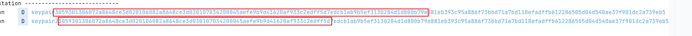

# local Key Attestation 验证饶过

## bootloaderspoofer 插件分析

https://github.com/chiteroman/BootloaderSpoofer

核心流程见注释
```agsl
public class Xposed implements IXposedHookLoadPackage {
    private static int indexOf(byte[] array) {
        final byte[] PATTERN = {48, 74, 4, 32, 0, 0, 0, 0, 0, 0, 0, 0, 0, 0, 0, 0, 0, 0, 0, 0, 0, 0, 0, 0, 0, 0, 0, 0, 0, 0, 0, 0, 0, 0, 0, 0, 1, 1, 0, 10, 1, 2};
        outer:
        for (int i = 0; i < array.length - PATTERN.length + 1; i++) {
            for (int j = 0; j < PATTERN.length; j++) {
                if (array[i + j] != PATTERN[j]) {
                    continue outer;
                }
            }
            return i;
        }
        return -1;
    }

    @Override
    public void handleLoadPackage(XC_LoadPackage.LoadPackageParam lpparam) {
        try {
            KeyStore keyStore = KeyStore.getInstance("AndroidKeyStore");
            KeyStoreSpi keyStoreSpi = (KeyStoreSpi) XposedHelpers.getObjectField(keyStore, "keyStoreSpi");
            XposedHelpers.findAndHookMethod(keyStoreSpi.getClass(), "engineGetCertificateChain", String.class, new XC_MethodHook() {
                @Override
                protected void afterHookedMethod(MethodHookParam param) throws Throwable {
                    Certificate[] certificates = (Certificate[]) param.getResultOrThrowable();
                    if (certificates[0] instanceof X509Certificate cert) {

                        for (Method method : cert.getClass().getMethods()) {
                            if (method.getName().toLowerCase(Locale.ROOT).contains("verify")) {
                                // verify 不抛出异常表示验证通过
                                XposedBridge.hookMethod(method, XC_MethodReplacement.DO_NOTHING);
                            }
                        }

                        //获取证书编码,修改部分偏移的数据
                        //修改Device locked:true
                        //修改Verified boot state: Verified
                        byte[] bytes = cert.getEncoded();
                        if (bytes == null || bytes.length == 0) return;
                        int index = indexOf(bytes);//这个索引？
                        if (index == -1) return;
                        bytes[index + 38] = 1;
                        bytes[index + 41] = 0;

                        //替换证书
                        CertificateFactory certFactory = CertificateFactory.getInstance("X.509");
                        X509Certificate modCert = (X509Certificate) certFactory.generateCertificate(new ByteArrayInputStream(bytes));
                        certificates[0] = modCert;
                        param.setResult(certificates);
                    }
                }
            });
        } catch (Throwable t) {
            XposedBridge.log(t);
        }
    }
}
```
这一版问题很明显，challenge 没有饶过，被修改的证书内容，实际无法通过公钥验证；


又更新了一个版本，卧槽 被大佬深厚的底蕴震撼
v3.5 , 这个版本的思路， 弥补之前的短板：

1. challenge 没有修复
2. 证书被修改后，实际没法通过公钥验证

那chiteroman怎么做的呢？
1. hook generateKeyPair ，返回插件预置的公私钥 
2. hook setAttestationChallenge ，实时获取challenge
3. 替代 engineGetCertificateChain  函数，伪造整条证书链、并写入challenge

是吧 这个思路看起来很nice ，不过也存在问题 , 始终使用的内置的公私钥。换句话说，无论生成几次公私钥，始终是同一个公私钥,这一点问题。

正常产生的公钥


安装插件后的公钥


